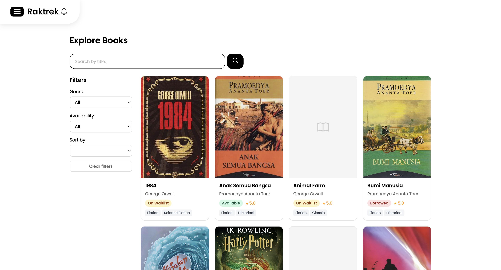

<p align="center">
  
</p>

<h1 align="center">RakTrek</h1>

<p align="center">
  A modern, web-based library management system for cataloguing, borrowing, and managing reading activity.
</p>

<p align="center">
  
  
  
  
</p>

---

## Overview

RakTrek is a full-stack library management system built for both members and staff. Members can browse the book catalogue, borrow books, join waitlists, write reviews, and follow favourite authors. Staff manage the catalogue, monitor borrowings, and handle administrative tasks — all from a dedicated admin panel.

## Screenshot



## Features

**For Members**
- Browse and search the book catalogue with filters (genre, year, language, availability)
- Borrow books and renew active loans
- Join a waitlist for unavailable books
- Write and manage reviews with star ratings
- Follow favourite authors and receive notifications for new releases
- Manage profile, notification preferences, and reading history

**For Staff (Admin)**
- Dashboard with library statistics
- Full CRUD for books, authors, and genres (with image uploads)
- Borrowing management — track active and overdue loans, process returns
- User management — view members, change roles, activate/deactivate accounts
- Waitlist oversight per book
- Reports

**General**
- Google OAuth login
- Email notifications (new book by followed author, due date reminders, overdue alerts, book available)
- Responsive design with mobile bottom navigation

## Tech Stack

| Layer | Technology |
|---|---|
| Backend | Laravel 10, PHP 8.1+ |
| Frontend | Svelte 4, Inertia.js |
| Auth | Laravel Sanctum + Google OAuth (Socialite) |
| Build | Vite 4 |
| Database | MySQL / SQLite |

## Database Schema


## Getting Started

### Prerequisites

- PHP 8.1+
- Composer
- Node.js 18+
- MySQL or SQLite

### Installation

```bash
# Clone the repository
git clone https://github.com/404NotFoundIndonesia/raktrek.git
cd raktrek

# Install PHP dependencies
composer install

# Install JS dependencies
npm install

# Copy environment file and generate app key
cp .env.example .env
php artisan key:generate

# Configure your database in .env, then run migrations
php artisan migrate

# Create storage symlink
php artisan storage:link
```

### Running Locally

```bash
# Terminal 1 — Laravel dev server
php artisan serve

# Terminal 2 — Vite dev server (hot reload)
npm run dev
```

Visit `http://localhost:8000`.

### Seeding

```bash
# Only default user
php artisan db:seed

# Master data only (real authors, books, genres + staff account)
php artisan db:seed --class=MasterDataSeeder

# Transaction data only
php artisan db:seed --class=TransactionSeeder

```

Default staff account after seeding: `admin@raktrek.test` / `password`

### Google OAuth (optional)

Add your credentials to `.env`:

```env
GOOGLE_CLIENT_ID=your-client-id
GOOGLE_CLIENT_SECRET=your-client-secret
GOOGLE_REDIRECT_URI=http://localhost:8000/auth/google/callback
```

## Project Structure

```
app/
├── Http/
│   ├── Controllers/          # Feature controllers
│   │   └── Admin/            # Staff-only controllers
│   └── Requests/             # Form validation
├── Models/                   # Eloquent models
└── Notifications/            # Email notifications

resources/
├── js/
│   ├── Pages/                # Inertia page components (Svelte)
│   │   └── Admin/            # Admin panel pages
│   └── Components/           # Shared Svelte components
└── css/
    └── app.css

database/
├── migrations/
└── seeders/
    ├── MasterDataSeeder.php  # Real books & authors
    └── TransactionSeeder.php # Sample borrowings & reviews

routes/
└── web.php                   # All application routes
```

## Available Commands

```bash
php artisan serve                        # Start dev server
php artisan migrate                      # Run migrations
php artisan migrate:fresh --seed         # Reset and seed database
php artisan test                         # Run test suite
npm run dev                              # Vite dev server
npm run build                            # Production build
./vendor/bin/pint                        # Format PHP code
```

## License

RakTrek is open-source software licensed under the [MIT license](https://opensource.org/licenses/MIT).
