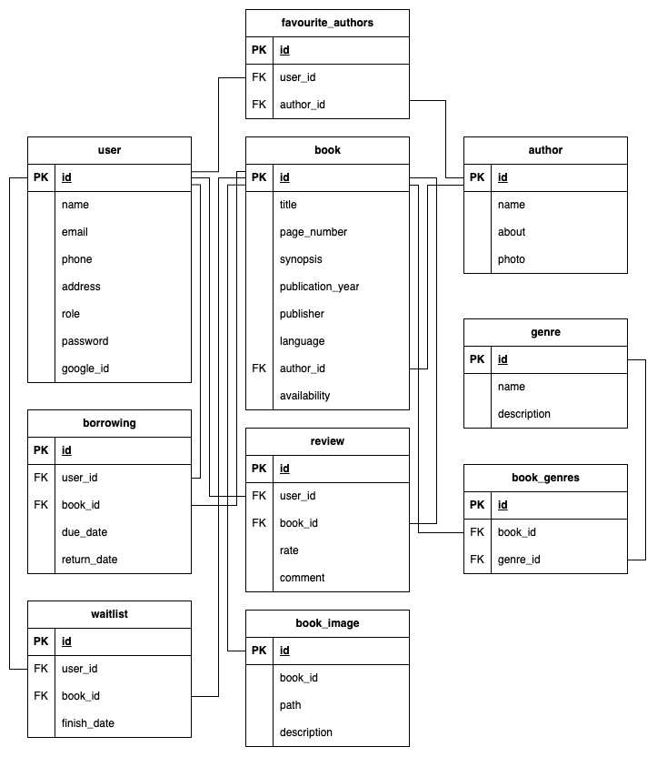

# RakTrek

RakTrek is a web-based platform designed to streamline and enhance the management and user experience of a library. It aims to provide users with a convenient way to explore the library's catalogue, borrow books, and manage their reading activities.

## Database Schema

## License

RakTrek is open-sourced software licensed under the [MIT license](https://opensource.org/licenses/MIT).
